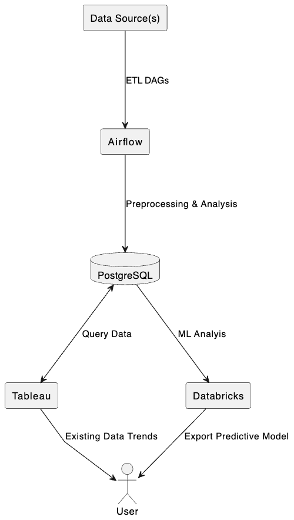

WIP practice project to explore data analytic tools and make my attempt at exploratory and predictive analysis of the relationship between physical activity and diabetes.

Architecture Diagram:

Docker Containers and Dependencies:
-Airflow (ETL orchestrator and monitoring)
-Redis (Message Broker)
-Postgres (Database)